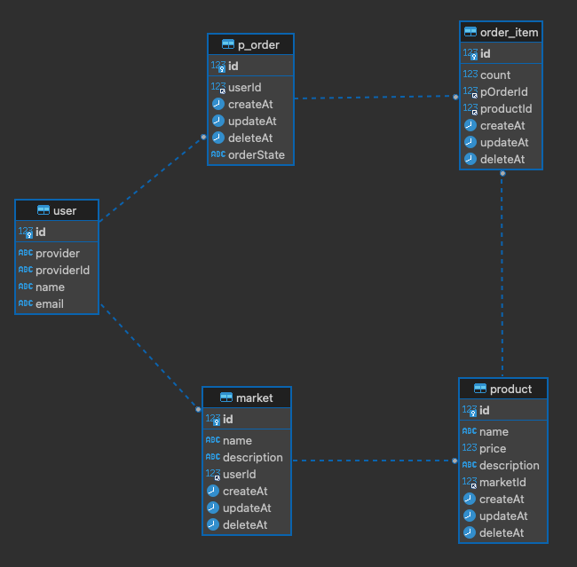

## 개요
- 쇼핑몰 서비스 구현

## 사용 기술
- TypeScript, NestJS, MySQL, Redis

## 패키지

    
공통

  - npm i @nestjs/config

    
DB

- npm install mysql2
- npm i typeorm
- npm i @nestjs/typeorm

    
Cache

- npm i cache-manager
- npm i @types/cache-manager
- npm i cache-manager-ioredis

    
Validator

- npm i class-validator
- npm i @nestjs/class-validator
- npm i class-transformer

    
사용자 인증

- npm i passport
- npm i @nestjs/passport
- npm i passport-google-oauth20
- npm i passport-jwt
- npm i @nestjs/jwt
- npm i cookie-parser
- npm i @types/cookie-parser

## 요구사항
- 사용자 인증
  - 사용자는 OAuth2 인증을 통해 인증 및 서비스를 이용할 수 있다.
- 마켓
  - 사용자는 자신의 마켓을 생성할 수 있다.
  - 사용자는 생성한 마켓 정보를 수정할 수 있다.
  - 사용자는 생성한 마켓 정보를 삭제할 수 있다.
- 상품
  - 마켓에 상품을 등록할 수 있다.
  - 등록한 상품 정보를 수정할 수 있다.
  - 등록한 상품 정보를 삭제할 수 있다.
  - 등록한 상품 및 상품 목록을 조회할 수 있다.
- 주문
  - 등록된 상품들을 주문할 수 있다.
  - 등록한 주문을 취소할 수 있다.
  - 사용자는 자신의 주문 목록을 조회할 수 있다.

## ER Diagram

## API
### 사용자
- 사용자 인증

| Method | URL          | Response        |
|--------|:-------------|:----------------|
| GET    | /auth/google | 사용자 가입 / 로그인 |

### 마켓
- 마켓 생성

| Method | URL          | Request Body | Response          |
|--------|--------------|--------------|-------------------|
| POST   | /api/markets | { &nbsp;&nbsp;name: 마켓명 &nbsp;&nbsp;description: 마켓 설명 } | status: 201|

- 마켓 정보 수정

| Method | URL                   | Request Path     | Request Body                                                  | Response    |
|--------|-----------------------|------------------|---------------------------------------------------------------|-------------|
| PUT    | /api/markets/marketId | marketId: 마켓 ID  | { &nbsp;&nbsp;name: 마켓명 &nbsp;&nbsp;description: 마켓 설명 } | status: 200 |

- 마켓 정보 삭제

| Method | URL                   | Request Path    | Response    |
|--------|-----------------------|-----------------|-------------|
| DELETE | /api/markets/marketId | marketId: 마켓 ID | status: 200 |

### 상품
- 상품 등록

| Method | URL           | Request Body                                                                                                | Response    |
|--------|---------------|-------------------------------------------------------------------------------------------------------------|-------------|
| POST   | /api/products | { &nbsp;&nbsp;name: 상품명 &nbsp;&nbsp;price: 상품 가격 &nbsp;&nbsp;상품 설명 &nbsp;&nbsp;marketId: 마켓 ID } | status: 201 |

- 상품 목록 조회

| Method | URL           | Request Param | Response                                                                                                          |
|--------|---------------|---------------|-------------------------------------------------------------------------------------------------------------------|
|GET |/api/products |{ &nbsp;&nbsp;keyword: 검색어 &nbsp;&nbsp;page: 페이지 번호} | status: 200 products : { &nbsp;&nbsp;id: 상품 ID &nbsp;&nbsp;name: 상품명 &nbsp;&nbsp;price: 상품 가격 } [] |

- 상품 상세 조회

| Method | URL                     | Request Path     | Response                                                                                                                                                                                          |
|--------|-------------------------|------------------|---------------------------------------------------------------------------------------------------------------------------------------------------------------------------------------------------|
| GET    | /api/products/productId | productId: 상품 ID | status: 200 { &nbsp;&nbsp;id: 상품 ID &nbsp;&nbsp;name: 상품명 &nbsp;&nbsp;price: 상품 가격 &nbsp;&nbsp;description: 상품 설명 &nbsp;&nbsp;marketName: 마켓명 &nbsp;&nbsp;username: 마켓 사업자명 } |

- 상품 정보 수정

| Method | URL                     | Request Path     | Request Body                                                                                                             | Response    |
|--------|-------------------------|------------------|--------------------------------------------------------------------------------------------------------------------------|-------------|
| PUT    | /api/products/productId | productId: 상품 ID | { &nbsp;&nbsp;name: 상품명 &nbsp;&nbsp;price: 상품 가격 &nbsp;&nbsp;description: 상품 설명 &nbsp;&nbsp;marketId: 마켓 ID } | status: 200 |

- 상품 정보 삭제

| Method | URL                     | Request Path     | Request Body    | Response    |
|--------|-------------------------|------------------|-----------------|-------------|
| DELETE | /api/products/productId | productId: 상품 ID | marketId: 마켓 ID | status: 200 |

### 주문
- 주문 등록

| Method | URL         | Request Body                                                                      | Response    |
|--------|-------------|-----------------------------------------------------------------------------------|-------------|
| POST   | /api/orders | orderItems: { &nbsp;&nbsp;productId: 상품 ID &nbsp;&nbsp;count: 주문 개수 } [] | status: 201 |

- 주문 조회

| Method | URL         | Response                                                                                          |
|--------|-------------|---------------------------------------------------------------------------------------------------|
| GET    | /api/orders | status: 200 orders: { &nbsp;&nbsp;orderId: 주문 ID &nbsp;&nbsp;totalPrice: 주문 총 금액 } [] |

- 주문 취소

| Method | URL                 | Request Path   | Response    |
|--------|---------------------|----------------|-------------|
| DELETE | /api/orders/orderId | orderId: 상품 ID | status: 200 |